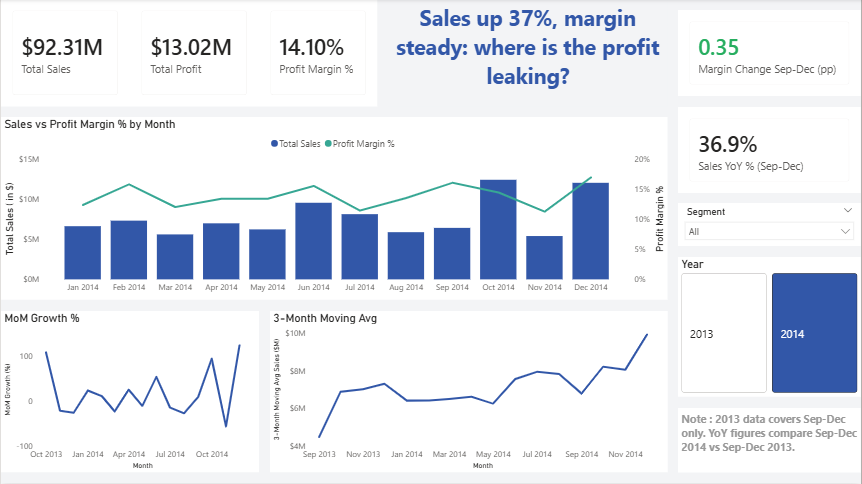
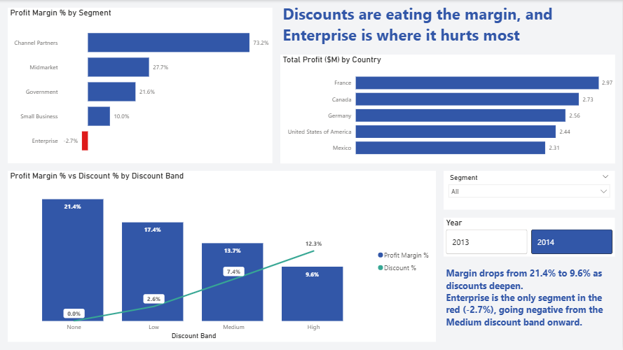
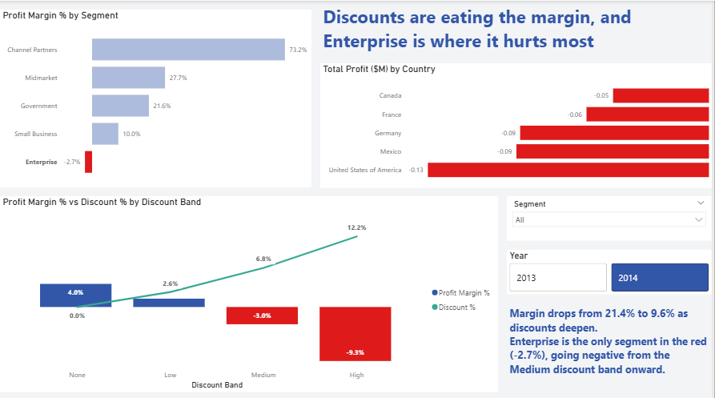
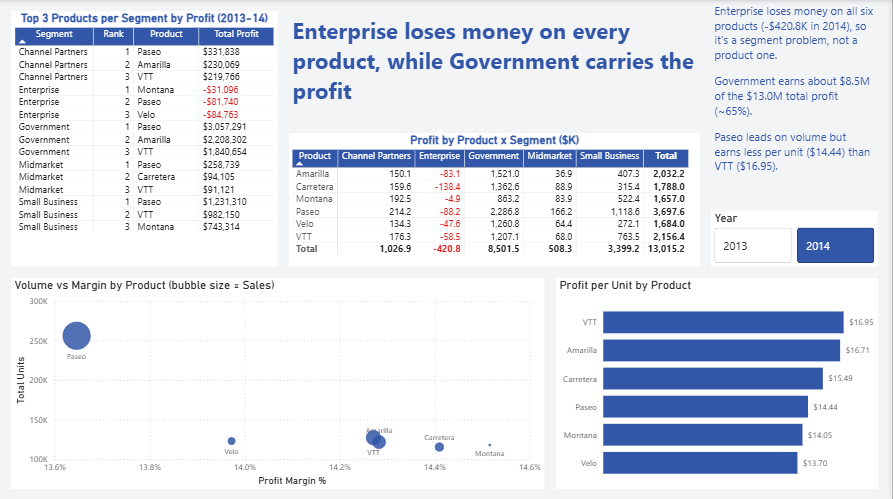

# Financial Performance Dashboard

An end-to-end analytics project on Microsoft's Financial Sample dataset: SQL for the analysis, Power BI for the interactive dashboard.

**Live dashboard:** <https://app.powerbi.com/view?r=eyJrIjoiM2EwNzM5YjItNGM4Ni00NjkzLWFmNTYtYTc4OWJhNjQxMDk3IiwidCI6IjkyYzI0YjQ4LTEzMDQtNGMyZi1iMTZjLWQ5MWRhNjY3MTVkOSIsImMiOjl9> (may expire, screenshots below are the permanent version)

**Business memo (1-page PDF):** [insights_and_recommendations_memo.pdf](insights_and_recommendations_memo.pdf)

## Business question

Sales were growing, but is profit keeping up? This project tries to answer three things:

1. Where is the company making and losing money?
2. What is driving the margin leak?
3. What should the business do about it?

## Dataset

Microsoft Financial Sample (public). It has sales, profit, discounts, segments, countries and products over 16 months (Sep 2013 to Dec 2014).

One thing to know: **2013 only covers Sep-Dec**, so full-year comparisons would be misleading. For year-over-year numbers I compared the same months (Sep-Dec 2014 vs Sep-Dec 2013), and the segment, country and product views are filtered to 2014.

## Approach

**1. SQL first** (`analytics_queries.sql`, SQLite database `financials.db`)
- Basic GROUP BY exploration of sales, profit and margin
- Month-over-month sales growth using a CTE and `LAG`
- Top 3 products per segment using `RANK() OVER (PARTITION BY segment ...)`
- 3-month moving average of sales

The notebooks (`01_data_setup.ipynb`, `02_advanced_sql.ipynb`) load the data, run the queries and export the results as CSVs (`mom_growth.csv`, `top_3_products_per_segment.csv`, `moving_avg_3month.csv`).

**2. Power BI**
- Cleaned the data in Power Query (e.g. blank discount bands set to "None")
- Built a date table and a measures table in DAX: Total Sales, Total Profit, Total COGS, Profit Margin %, MoM Growth %
- Used a hybrid setup: DAX measures for the interactive visuals, and the SQL query results brought in as their own visuals (the top 3 table and the trend charts)
- All SQL-based numbers were checked against the Power BI figures

## Dashboard

### Page 1: Executive summary

### Page 2: Segment and geography

With Enterprise selected, the discount chart shows where the losses come from:

### Page 3: Product deep-dive

The "Top 3 Products per Segment" table comes from the SQL ranking query and covers all years, so it does not follow the Year slicer.

## Key findings (2014)

- **Sales are growing and margin is roughly flat.** Sep-Dec 2014 sales were up 36.9% on the same months in 2013, with margin up 0.35 percentage points. Month-to-month sales are very volatile (from -56.5% to +122.9%), but the 3-month moving average climbs from about $6.5M in March to $9.9M in December 2014.
- **Discounting is where margin leaks.** Margin falls from 21.4% with no discount to 9.6% in the High discount band.
- **Enterprise is the only loss-making segment** (-$420.8K, -2.7% margin). It loses money on all six products. It sells everything at $125 per unit against a $120 cost, so its margin is only 4% before discounts, and it turns negative from the Medium discount band (-3.0%) and gets worse in the High band (-9.3%).
- **Government carries the profit:** about $8.5M of the $13.0M total (~65%). Paseo is the top product in 4 of 5 segments and leads on volume, but earns less per unit ($14.44) than VTT ($16.95) or Amarilla ($16.71).

## Recommendations

1. Put approval rules or caps on Medium and High discounts, since that is where margin drops the most.
2. Keep Enterprise discounts under about 4% and review its pricing, because the losses are across every product, which points to a segment-level problem.
3. Protect the Government accounts, and look at pricing on Paseo, which sells the most units but earns less per unit than other products.

## Repo contents

| File | What it is |
|---|---|
| `analytics_queries.sql` | All SQL queries (basic + advanced) |
| `01_data_setup.ipynb` | Loads the data into SQLite, basic exploration |
| `02_advanced_sql.ipynb` | Runs the advanced queries and exports results |
| `financials.db` | SQLite database |
| `financials_export.csv`, `mom_growth.csv`, `moving_avg_3month.csv`, `top_3_products_per_segment.csv` | Data used by Power BI |
| `financial_performance_dashboard.pbix` | Power BI file |
| `financial_performance_dashboard.pdf` | PDF export of the dashboard |
| `insights_and_recommendations_memo.pdf` | 1-page memo with 3 insights and recommendations |
| `screenshots/` | Dashboard screenshots used above |

## Tools

SQL (SQLite), Python (pandas, Jupyter), Power BI, DAX, Power Query, Git/GitHub
